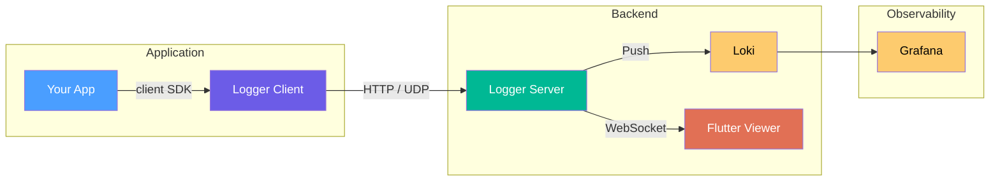

# Logger

A real-time structured log viewer for application debugging. Push logs from any app via a TypeScript SDK, view them instantly in a Flutter desktop viewer, and persist to Grafana Loki.

## Features

- **Real-time streaming** — sub-second latency from emission to display via WebSocket
- **Structured entries** — severity, timestamps, sessions, tags, and rich content types
- **Custom renderers** — progress bars, tables, charts, key-value pairs, stack traces
- **ANSI color support** — full color rendering with SDK helpers (`red`, `bold`, `rgb`)
- **Session management** — group and navigate logs by application run
- **Filtering** — severity, free-text, source/tag, and time range filters
- **Grafana dashboards** — pre-configured dashboards for log volume and server health

## Quick Start

The fastest path — no Docker required.

### Prerequisites

- [Bun](https://bun.sh/) 1.0+
- [Flutter](https://docs.flutter.dev/get-started/install) 3.10+

### 1. Start the Server

```bash
cd packages/server && bun install && bun run src/main.ts
```

### 2. Run the Viewer

```bash
cd app && flutter pub get && flutter run -d linux
```

The viewer auto-connects to `ws://localhost:8080/api/v2/stream`. Loki connection warnings in the server console are expected without Docker and can be ignored.

### 3. Send Test Logs

```bash
cd packages/demo && bun install && bun run src/main.ts
```

## Full Stack Setup (Docker)

For Loki persistence and Grafana dashboards:

```bash
docker compose up -d
cd app && flutter build linux && ./build/linux/x64/release/bundle/app
```

Services: Loki (storage), Grafana (http://localhost:3000, admin/admin), Server (http://localhost:8080), Demo (sample traffic).

## Client SDK

```typescript
import { Logger } from "@logger/client";

const logger = new Logger({ url: "http://localhost:8080" });
logger.info("Application started", { version: "1.0.0" });
logger.error("Something went wrong", { error: err.message });
```

## Architecture



| Component | Language | Description |
|-----------|----------|-------------|
| **Client SDK** | TypeScript | Sends structured log entries to the server |
| **Server** | TypeScript (Bun) | Receives logs via HTTP/UDP, streams to viewers, pushes to Loki |
| **Viewer** | Dart (Flutter) | Desktop app for real-time log viewing with rich rendering |
| **Shared** | TypeScript | Common types, schemas, and constants |

## Documentation

- [Getting Started](docs/guides/getting-started.md) — setup tutorial
- [Features](docs/guides/features.md) — viewer capabilities
- [Configuration](docs/reference/configuration.md) — all `LOGGER_*` env vars
- [Protocol](docs/reference/protocol.md) — LogEntry schema reference
- [Plugin API](docs/reference/plugin-api.md) — custom renderer/filter plugins
- [Architecture](docs/architecture/README.md) — system design and ADRs

## Contributing

See [CONTRIBUTING.md](CONTRIBUTING.md).

## License

[Mozilla Public License 2.0](LICENSE)
