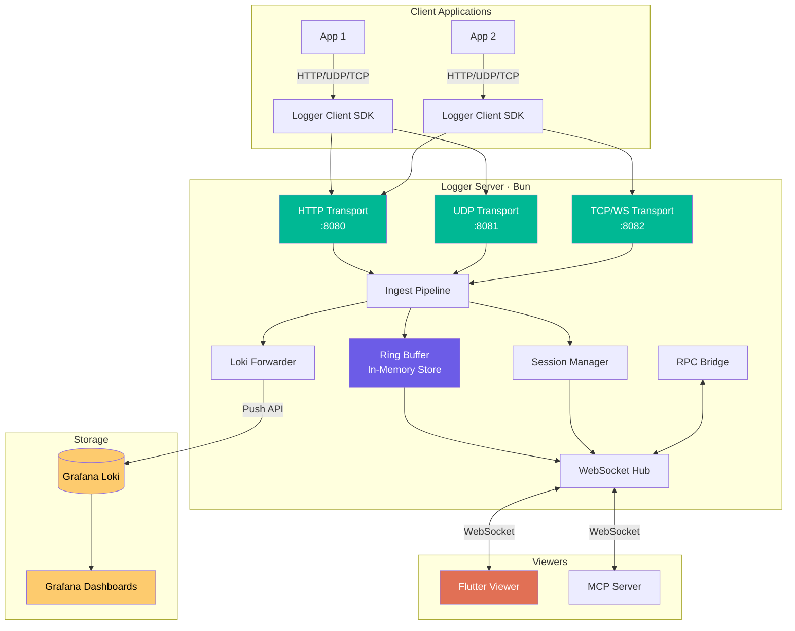
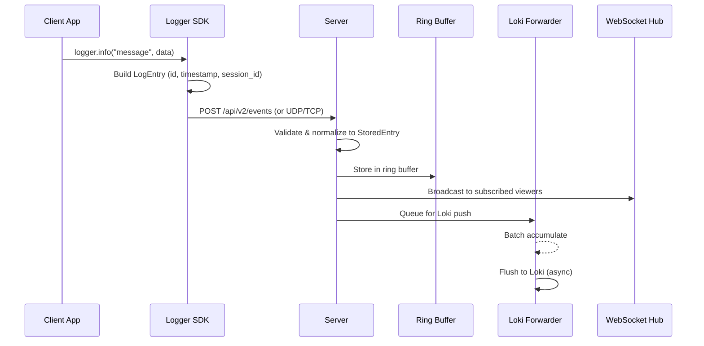
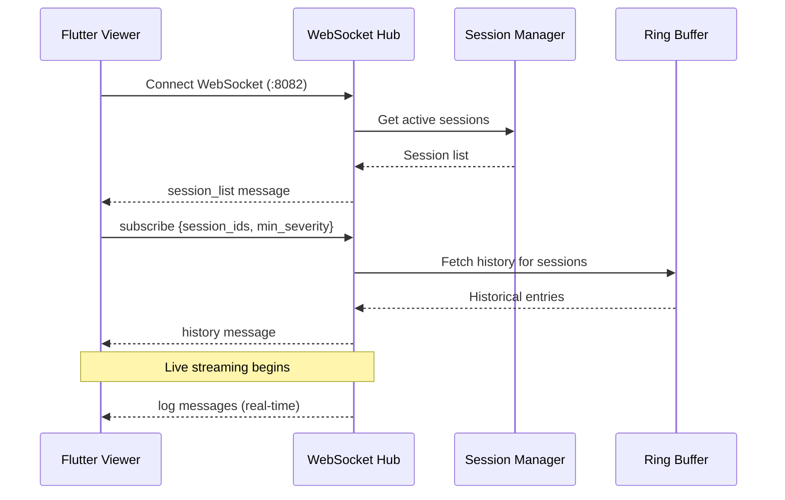
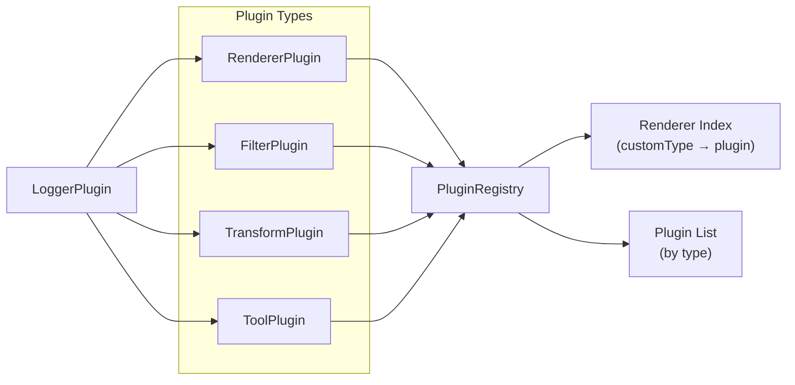

# Logger — System Index

> The single-document reference for the entire Logger system.
> For anyone — developer, designer, or AI — who needs a complete understanding.

---

## Table of Contents

1. [Executive Summary](#1-executive-summary)
2. [Architecture Overview](#2-architecture-overview)
3. [Component Deep Dives](#3-component-deep-dives)
4. [Plugin System](#4-plugin-system)
5. [UX Design System](#5-ux-design-system)
6. [Configuration Reference](#6-configuration-reference)
7. [Protocol Reference](#7-protocol-reference)
8. [Decision Log](#8-decision-log)
9. [File Structure Map](#9-file-structure-map)

---

## 1. Executive Summary

**Logger** is a real-time, structured log viewer for application debugging. It is a local-development tool — not production SaaS. No authentication by default. Linux-first.

### What It Does

Applications push structured logs via a TypeScript client SDK to a Bun-based server. The server stores logs in an in-memory ring buffer for instant viewer access and asynchronously forwards them to Grafana Loki for persistence. A Flutter desktop app provides live log viewing with rich rendering, filtering, and bidirectional RPC.

### Who It's For

- **Application developers** debugging complex multi-service applications
- **Teams** that need shared visibility into real-time application behavior
- **AI agents** (via MCP server) that need programmatic access to application logs

### Key Features

| Feature | Description |
|---------|-------------|
| **Real-time streaming** | Sub-second latency from log emission to display via WebSocket |
| **Structured entries** | Severity, timestamps, sessions, tags, custom types, exceptions |
| **Rich rendering** | Progress bars, tables, charts, key-value pairs, stack traces, images |
| **Session management** | Logs grouped by application run; sidebar navigation |
| **Filtering** | Severity, text search, source, tags, custom plugin filters |
| **Plugin architecture** | Extensible renderers, filters, transforms, and tools |
| **Grafana dashboards** | Pre-configured overview, server health, and session detail dashboards |
| **Bidirectional RPC** | Viewer can invoke tools registered by client applications |
| **Docker sidecar** | Captures Docker container stdout/stderr as structured logs |
| **MCP server** | Model Context Protocol tools for AI agent log access |
| **Sticky pinning** | Important entries pin to viewport top when scrolled past |
| **Custom types** | `type: "custom"` with arbitrary `custom_type` + `custom_data` |

### Technology Stack

| Component | Technology | Rationale |
|-----------|-----------|-----------|
| Server | TypeScript / Bun | Native TS, fast startup, built-in test runner, UDP/TCP/WS support |
| Client SDK | TypeScript | Matches most application ecosystems |
| Viewer | Dart / Flutter | Rich widget system, GPU-accelerated rendering, Linux-native |
| Storage | Grafana Loki | Label-based log storage, low resource usage, Grafana integration |
| Dashboards | Grafana | Pre-built LogQL dashboards, standard observability tool |
| Schemas | Zod | Single source of truth in `shared/`, consumed by server + client |

---

## 2. Architecture Overview

Logger follows a **hub-and-spoke** pattern: a central server receives logs from multiple clients and fans them out to viewers and storage backends.

### System Diagram



### Data Flow: Log Ingestion



### Data Flow: Viewer Connection



### Ports (Default)

| Port | Service | Protocol |
|------|---------|----------|
| 8080 | Server HTTP API | HTTP (log ingestion, health, upload) |
| 8081 | Server UDP ingest | UDP (high-throughput logs) |
| 8082 | Server TCP/WS | TCP + WebSocket (viewer connections) |
| 3000 | Grafana | HTTP (dashboards) |
| 3100 | Loki | HTTP (internal, push API) |

---

## 3. Component Deep Dives

### 3.1 Server (`packages/server/src/`)

The server is a modular Bun/TypeScript application. Entry point: `packages/server/src/main.ts`.

#### Modules

| Module | File | Lines | Responsibility |
|--------|------|-------|----------------|
| **HTTP Transport** | `transport/http.ts` | 192 | REST API: `/api/v2/` endpoints (session, events, data, upload, health, query) |
| **UDP Transport** | `transport/udp.ts` | ~50 | High-throughput UDP log ingestion via `Bun.udpSocket()` |
| **TCP Transport** | `transport/tcp.ts` | 92 | TCP + WebSocket for viewer connections |
| **Ingest Pipeline** | `transport/ingest.ts` | ~80 | Validates via Zod, normalizes to StoredEntry, routes to buffer/hub/loki |
| **Ring Buffer** | `modules/ring-buffer.ts` | 179 | In-memory log storage with size-based and count-based eviction |
| **Session Manager** | `modules/session-manager.ts` | 157 | Tracks active sessions, heartbeats, lifecycle events |
| **Loki Forwarder** | `modules/loki-forwarder.ts` | 177 | Async batch push to Grafana Loki with retry logic |
| **WebSocket Hub** | `modules/ws-hub.ts` | 154 | Manages viewer connections, subscriptions, broadcasting |
| **RPC Bridge** | `modules/rpc-bridge.ts` | 147 | Bidirectional RPC between viewers and client applications |
| **File Store** | `modules/file-store.ts` | 183 | Disk-based storage for uploaded images |
| **Normalizer** | `core/normalizer.ts` | ~80 | Normalizes input messages to StoredEntry |
| **Hooks** | `core/hooks.ts` | 80 | Extensible hook system for the pipeline |
| **Rate Limiter** | `core/rate-limiter.ts` | 79 | Global and per-session rate limiting |
| **Config** | `core/config.ts` | ~50 | Environment variable configuration |

#### Transport Selection

| Transport | Use Case | Pros | Cons |
|-----------|----------|------|------|
| HTTP | Default, reliable | Works everywhere, request/response | Higher overhead |
| UDP | High-throughput | Lowest latency, no connection overhead | Fire-and-forget, no ack |
| TCP | Persistent connection | Lower overhead than HTTP, ordered delivery | Connection management |
| WebSocket | Viewer + MCP | Full duplex, subscriptions | Not for log ingestion |

#### Ring Buffer

The ring buffer stores recent log entries in memory for instant viewer access. When capacity limits are reached (either count or byte size), the oldest entries are evicted.

- **Max entries**: `LOGGER_BUFFER_MAX_ENTRIES` (default: 1,000,000)
- **Max bytes**: `LOGGER_BUFFER_MAX_BYTES` (default: 256 MB)
- **Server memory budget**: 512 MB container limit (compose.yml)

#### Loki Forwarder

Asynchronous batch forwarding to Grafana Loki:
- Accumulates entries into batches of `LOGGER_LOKI_BATCH_SIZE` (default: 100)
- Flushes at `LOGGER_LOKI_FLUSH_MS` intervals (default: 1000ms)
- Retries failed pushes up to `LOGGER_LOKI_RETRIES` times (default: 3)
- Buffers up to `LOGGER_LOKI_MAX_BUFFER` entries before dropping (default: 10,000)

### 3.2 Client SDK (`packages/client/src/`)

Lightweight TypeScript library for sending structured logs. Entry point: `packages/client/src/logger.ts`.

#### Architecture

| File | Lines | Responsibility |
|------|-------|----------------|
| `logger.ts` | 500 | Main `Logger` class — transport selection, fluent API, log dispatch |
| `logger-session.ts` | ~80 | Session lifecycle: start, heartbeat (periodic), end |
| `logger-builders.ts` | ~100 | Fluent builders for complex log entries |
| `logger-types.ts` | ~60 | Type definitions for client configuration |
| `queue.ts` | ~80 | Batching queue with configurable flush interval and max size |
| `stack-parser.ts` | ~60 | Cross-runtime stack trace parsing (V8, SpiderMonkey, JavaScriptCore) |
| `transport/ws.ts` | 112 | WebSocket transport option for persistent connections |

#### Client Usage

```typescript
import { Logger } from "@logger/client";

const logger = new Logger({
  url: "http://localhost:8080",
  application: { name: "my-app", version: "1.0.0" },
});

// Simple logging
logger.info("Application started");
logger.error("Request failed", { error: err.message });
logger.debug("Cache hit", { key: "user:123" });

// Structured logging
logger.log({
  severity: "info",
  type: "custom",
  custom_type: "progress",
  custom_data: { label: "Processing", value: 0.75 },
});

// Session control
const session = logger.session("deploy-v1.2.3");
session.info("Starting deployment");
session.end();
```

#### Transport Selection

The client automatically selects transport based on the URL:
- `http://` or `https://` → HTTP transport (default)
- `ws://` or `wss://` → WebSocket transport (persistent)
- UDP transport available for high-throughput scenarios

#### Batching Queue

Logs are accumulated in a queue and flushed in batches to reduce HTTP overhead:
- Flush interval: configurable (default: 100ms)
- Max batch size: configurable (default: 100 entries)
- Immediate flush on severity ≥ error

### 3.3 Flutter Viewer (`app/lib/`)

The desktop viewer is a Flutter/Dart application (Linux-first). Entry point: `app/lib/main.dart`.

#### Directory Structure

| Directory | Responsibility |
|-----------|----------------|
| `models/` | Dart data models mirroring shared Zod schemas |
| `plugins/` | Plugin system — registry, types, built-in plugins |
| `screens/` | Top-level screen widgets |
| `services/` | WebSocket client, state management (Provider pattern) |
| `theme/` | Custom dark theme, color tokens, typography |
| `widgets/` | Reusable UI components — log list, renderers, filters, header |

#### Key Files

| File | Lines | Purpose |
|------|-------|---------|
| `models/log_entry.dart` | 396 | LogEntry Dart model, deserialization from JSON |
| `widgets/header/session_selector.dart` | 391 | Session sidebar with selection and filtering |
| `widgets/log_list/log_list_view.dart` | 274 | Virtualized scrolling log list |
| `widgets/renderers/json_renderer.dart` | 232 | JSON syntax-highlighted rendering |
| `screens/log_viewer.dart` | 221 | Main log viewer screen layout |
| `widgets/log_list/log_row.dart` | 219 | Individual log entry row widget |
| `services/connection_manager.dart` | ~120 | Multi-server connection management with auto-reconnect |
| `services/log_store.dart` | 104 | Log entry state management |
| `services/log_store_stacking.dart` | ~80 | Entry stacking (version history) logic |
| `screens/log_viewer_keyboard.dart` | ~80 | Keyboard shortcut handler |
| `services/session_store.dart` | 71 | Session state management |

#### State Management

Uses Provider pattern:
- `LogStore` — holds log entries, handles filtering and grouping
- `SessionStore` — tracks sessions and selection state
- `RpcService` — manages RPC state and tool panels

#### Rendering Pipeline

1. `LogEntry` arrives via WebSocket → deserialized into Dart model
2. `LogListView` renders entries using virtualized scrolling
3. `LogRow` dispatches to `RendererFactory` based on entry `type`
4. For `type: "custom"` → `PluginRegistry.resolveRenderer(customType)`
5. Matching `RendererPlugin.buildRenderer()` produces the widget

#### Renderers

| Renderer | File | Handles |
|----------|------|---------|
| Text | `renderers/text_renderer.dart` | `type: "text"` — plain text with syntax highlighting |
| JSON | `renderers/json_renderer.dart` | `type: "json"` — collapsible syntax-highlighted JSON |
| HTML | `renderers/html_renderer.dart` | `type: "html"` — rendered HTML content |
| Binary | `renderers/binary_renderer.dart` | `type: "binary"` — hex dump with ASCII sidebar |
| Image | `renderers/image_renderer.dart` | `type: "image"` — inline images (base64 or upload ref) |
| Stack Trace | `renderers/stack_trace_renderer.dart` | Exception data — collapsible, syntax-highlighted |
| Session | `renderers/session_renderer.dart` | `type: "session"` — session start/end markers |
| State | `renderers/state_renderer.dart` | `type: "state"` — key-value state display |
| Group | `renderers/group_renderer.dart` | Group headers and bodies |
| RPC | `renderers/rpc_renderer.dart` | `type: "rpc"` — RPC request/response rendering |
| Custom | `renderers/custom_renderer.dart` | Dispatches to registered `RendererPlugin` |
| Progress | `plugins/builtin/progress_plugin.dart` | `custom_type: "progress"` — progress bars |
| Table | `plugins/builtin/table_plugin.dart` | `custom_type: "table"` — tabular data |
| Key-Value | `plugins/builtin/kv_plugin.dart` | `custom_type: "kv"` — aligned key-value pairs |
| Chart | `plugins/builtin/chart_plugin.dart` | `custom_type: "chart"` — inline charts |

### 3.4 MCP Server (`packages/mcp/src/`)

A Model Context Protocol server exposing Logger tools for AI agents. Entry point: `packages/mcp/src/index.ts`.

#### Purpose

Allows AI agents (e.g., GitHub Copilot, Claude) to query and interact with Logger via standardized MCP tools. Connects to the Logger server via HTTP API.

#### Tools

| Tool | Description |
|------|-------------|
| `logger.health` | Get server health status (connections, buffer usage, Loki state) |
| `logger.sessions` | List active and recent sessions |
| `logger.query` | Query log entries with filters (session, severity, time range) |
| `logger.tail` | Stream recent log entries |
| `logger.rpc` | Invoke RPC tools registered by client applications |

#### Configuration

| Variable | Default | Description |
|----------|---------|-------------|
| `LOGGER_URL` | `http://localhost:8080` | Logger server HTTP endpoint |
| `LOGGER_API_KEY` | *(empty)* | API key for authenticated access |

### 3.5 Docker Sidecar (`packages/docker-sidecar/src/`)

A Docker log collector that reads container stdout/stderr and forwards them as structured Logger entries. Entry point: `packages/docker-sidecar/src/main.ts`.

#### How It Works

1. Connects to Docker socket (`/var/run/docker.sock`)
2. Listens for container start/die events
3. Attaches to stdout/stderr of running containers
4. Parses log lines and forwards as `LogEntry` via the client SDK
5. Each container gets its own Logger session

#### Configuration

| Variable | Default | Description |
|----------|---------|-------------|
| `DOCKER_SOCKET` | `/var/run/docker.sock` | Docker socket path |
| `LOGGER_SERVER_URL` | `http://localhost:8080` | Logger server endpoint |
| `CONTAINER_FILTER` | *(empty)* | Regex filter for container names |

### 3.6 Shared Schemas (`packages/shared/src/`)

Zod schemas that serve as the **single source of truth** for the protocol. Consumed by server, client, and MCP.

| File | Responsibility |
|------|----------------|
| `stored-entry.ts` | `StoredEntry` schema — all fields, types, and validation |
| `event-message.ts` | Event log input schema |
| `data-message.ts` | Data/state input schema |
| `session-message.ts` | Session lifecycle input schema |
| `server-broadcast.ts` | Server → Viewer WebSocket broadcast messages |
| `viewer-command.ts` | Viewer → Server WebSocket command messages |
| `widget.ts` | Widget/custom renderer type definitions |
| `constants.ts` | Shared constants (ports, limits, defaults) |
| `index.ts` | Re-exports for package consumers |

### 3.7 Demo (`packages/demo/src/`)

Generates realistic sample log traffic for development and testing. Entry point: `packages/demo/src/main.ts`.

#### Scenarios

Located in `packages/demo/src/scenarios/`:

| Scenario | Description |
|----------|-------------|
| Text logging | Varied text entries across severity levels |
| JSON payloads | Structured JSON data entries |
| Error scenarios | Exceptions with stack traces, chained causes |
| Custom renderers | Progress bars, tables, charts, key-value data |
| Image logging | Inline images (base64 and upload) |
| Session lifecycle | Session start, heartbeat, end events |
| Group operations | Collapsible log groups |
| State management | Key-value state updates |
| RPC tooling | RPC tool registration and invocation |

---

## 4. Plugin System

### 4.1 Architecture

The viewer uses a **registry-based plugin architecture** with typed abstract interfaces for each extension point. All plugins register with the global `PluginRegistry` singleton.



### 4.2 Plugin Types

| Type | Interface | Purpose | Key Method |
|------|-----------|---------|------------|
| **Renderer** | `RendererPlugin` | Renders custom log entry types | `buildRenderer()` → `Widget` |
| **Filter** | `FilterPlugin` | Custom filtering with autocomplete | `matches()` → `bool` |
| **Transform** | `TransformPlugin` | Text transformations on display | `transform()` → `String` |
| **Tool** | `ToolPlugin` | Adds tool panels to the UI | `buildToolPanel()` → `Widget` |

### 4.3 Base Interface

Every plugin implements `LoggerPlugin`:

```dart
abstract class LoggerPlugin {
  String get id;           // Reverse-domain identifier (e.g., "dev.logger.chart")
  String get name;         // Human-readable display name
  String get version;      // SemVer version string
  String get description;  // Short description
  bool get enabled;        // Whether currently active
  PluginManifest get manifest;

  void onRegister(PluginRegistry registry);
  void onDispose();
}
```

### 4.4 Plugin Manifest

```dart
class PluginManifest {
  final String id;
  final String name;
  final String version;
  final String description;
  final List<String> types;     // e.g., ['renderer'], ['filter', 'transform']
  final PluginTier tier;        // stdlib | community
}
```

### 4.5 Registry

`PluginRegistry.instance` is a global singleton:

| Method | Description |
|--------|-------------|
| `register(plugin)` | Register a plugin. Rejects duplicate IDs. |
| `unregister(pluginId)` | Remove by ID, calls `onDispose()`. |
| `resolveRenderer(customType)` | O(1) lookup for renderer plugins. |
| `getPlugins<T>()` | Get all plugins of type `T`. |
| `getEnabledPlugins<T>()` | Get all enabled plugins of type `T`. |
| `getPlugin(pluginId)` | Look up by ID. |
| `setEnabled(pluginId, enabled)` | Toggle plugin on/off. |
| `disposeAll()` | Dispose and clear everything. |

### 4.6 Built-in Plugins (stdlib)

| Plugin | Type | Custom Types | Description |
|--------|------|-------------|-------------|
| `dev.logger.chart` | Renderer | `chart` | Sparkline, bar, and area chart visualizations |
| `dev.logger.progress` | Renderer | `progress` | Progress bar with percentage display |
| `dev.logger.table` | Renderer | `table` | Tabular data with headers and rows |
| `dev.logger.kv` | Renderer | `kv` | Aligned key-value pair display |
| `dev.logger.id-uniquifier` | Transform | — | Adds unique suffixes to ambiguous IDs |
| `dev.logger.smart-search` | Filter | — | Intelligent search with autocomplete |
| `dev.logger.log-type-filter` | Filter | — | Filter by log entry type |

### 4.7 Extensibility Tiers

The plugin system is designed around three tiers of extensibility to accommodate Flutter's AOT compilation constraint:

| Tier | Model | Capabilities | Distribution | Status |
|------|-------|-------------|--------------|--------|
| **Tier 1** | Declarative JSON | Regex filters, pattern transforms, keyword search | Zip/git/local | Now |
| **Tier 2** | Lua scripting | Arbitrary string logic, stateful transforms | Zip/git/local | Planned |
| **Tier 3** | Pre-compiled `.so` | Full native code, Widget rendering via FFI | Pre-built binaries | Future |

**Why tiered:** Flutter AOT prevents dynamic Dart code loading. Community plugins that don't require recompilation use Tier 1 (safe, no code execution) or Tier 2 (sandboxed). Full widget-level power requires compiled plugins (stdlib) or Tier 3 (future).

### 4.8 Community Plugin Distribution

Community plugins can be installed from:
- **Git URL**: `git+https://github.com/user/plugin.git@v1.0.0`
- **Zip URL**: `https://example.com/plugin.zip#sha256=abc123...`
- **Local path**: `/home/user/plugins/my-plugin`
- **Drag-and-drop**: `.zip` files dropped onto the plugin settings panel

Installed to `~/.config/logger/plugins/{plugin-id}/`.

#### Integrity Verification

Plugins can include an integrity hash for tamper detection:
- **URL fragment**: `#sha256=hex...` (highest priority)
- **Manifest field**: `integrity: "sha256-base64..."` (SRI format)
- **No hash**: Warning dialog shown, user must confirm

Supported algorithms: SHA-256 (recommended), SHA-384, SHA-512.

### 4.9 Community Plugin Manifest

Extended from the base `PluginManifest`:

```json
{
  "id": "com.example.sql-formatter",
  "name": "SQL Formatter",
  "version": "1.0.0",
  "description": "Pretty-prints SQL queries in log entries",
  "author": { "name": "Jane Developer", "url": "https://jane.dev" },
  "license": "MIT",
  "repository": "https://github.com/jane/logger-sql-formatter",
  "tier": "community",
  "min_logger_version": "1.0.0",
  "types": ["transform"],
  "integrity": "sha256-47DEQpj8HBSa+/TImW+5JCeuQeRkm5NMpJWZG3hSuFU=",
  "keywords": ["sql", "formatter"],
  "settings": [
    { "key": "dialect", "type": "enum", "options": ["generic", "postgresql"], "default": "generic" }
  ]
}
```

---

## 5. UX Design System

### 5.1 Design Philosophy

Logger is a **developer tool for extended use**. The UI is optimized for:
- **Information density** — every pixel conveys information; no decorative elements
- **Low visual fatigue** — dark theme, warm low-saturation palette, WCAG AA+ contrast
- **Severity as primary signal** — colored bars for instant visual scanning
- **Responsive without breakpoints** — adapts via `LayoutBuilder` to three size modes

### 5.2 Background Layers

Backgrounds form a depth hierarchy from deepest to most prominent:

| Token | Hex | Usage |
|-------|-----|-------|
| `bg.base` | `#0B0E14` | Window background, deepest layer |
| `bg.surface` | `#0F1219` | Log list background, main content area |
| `bg.raised` | `#141820` | Header bar, section headers, cards |
| `bg.overlay` | `#1A1F2B` | Dropdowns, tooltips, floating panels |
| `bg.hover` | `#1E2433` | Hovered log line, hovered button |
| `bg.active` | `#252C3A` | Active/selected log line, pressed button |
| `bg.divider` | `#1C2130` | Section dividers, subtle borders |

### 5.3 Foreground / Text

| Token | Hex | Usage |
|-------|-----|-------|
| `fg.primary` | `#D4CCBA` | Primary log text, headings |
| `fg.secondary` | `#8A8473` | Timestamps, metadata, labels |
| `fg.muted` | `#565165` | Disabled text, placeholders, line numbers |
| `fg.inverse` | `#0B0E14` | Text on bright backgrounds (badges) |

### 5.4 Borders

| Token | Hex | Usage |
|-------|-----|-------|
| `border.subtle` | `#1C2130` | Dividers between log lines (1px) |
| `border.default` | `#2A3040` | Input borders, panel edges |
| `border.focus` | `#E6B455` | Focus rings, active input |

### 5.5 Severity Colors

Each severity has three variants: bar (full saturation), background tint (low opacity), and text (readable on dark).

| Severity | Bar | Background Tint | Text |
|----------|-----|-----------------|------|
| Debug | `#636D83` | `#636D8310` | `#636D83` |
| Info | `#7EB8D0` | `#7EB8D010` | `#7EB8D0` |
| Warning | `#E6B455` | `#E6B45512` | `#E6B455` |
| Error | `#E06C60` | `#E06C6015` | `#F07668` |
| Critical | `#D94F68` | `#D94F6820` | `#F4708B` |

### 5.6 Session / App Colors

12 colors that cycle for multi-app sessions, assigned round-robin by order of first log received:

| Index | Hex | Name |
|-------|-----|------|
| 0 | `#7EB8D0` | pool-cyan |
| 1 | `#E6B455` | pool-amber |
| 2 | `#A8CC7E` | pool-green |
| 3 | `#D99AE6` | pool-lavender |
| 4 | `#F07668` | pool-salmon |
| 5 | `#6EB5A6` | pool-teal |
| 6 | `#D4A07A` | pool-peach |
| 7 | `#8DA4EF` | pool-periwinkle |
| 8 | `#E68ABD` | pool-rose |
| 9 | `#B8CC52` | pool-lime |
| 10 | `#CC8C7A` | pool-clay |
| 11 | `#7ACCE6` | pool-sky |

### 5.7 Syntax Highlighting

| Token | Hex | Usage |
|-------|-----|-------|
| `syntax.string` | `#A8CC7E` | Quoted strings |
| `syntax.number` | `#E6B455` | Numeric values |
| `syntax.boolean` | `#F07668` | `true` / `false` |
| `syntax.null` | `#636D83` | `null`, `undefined` |
| `syntax.key` | `#7EB8D0` | JSON keys, property names |
| `syntax.date` | `#D99AE6` | ISO 8601 dates |
| `syntax.url` | `#6EB5A6` | URLs (underlined) |
| `syntax.punctuation` | `#565165` | Braces, brackets, commas |
| `syntax.error` | `#F07668` | Error type names |
| `syntax.path` | `#8DA4EF` | File paths in stack traces |
| `syntax.lineNumber` | `#636D83` | Line:column references |

### 5.8 Typography

| Role | Font | Size | Weight |
|------|------|------|--------|
| Log content | JetBrains Mono | 12dp | Regular |
| Timestamps | JetBrains Mono | 10dp | Regular |
| UI chrome | Inter | 11dp | Medium |
| Badges | Inter | 9dp | Bold |

Both fonts are bundled as assets (OFL-licensed). No network font loading.

### 5.9 Responsive Layout

| Mode | Width | Behavior |
|------|-------|----------|
| Widget | 240–400dp | Minimal chrome, icon-only controls |
| Compact | 401–700dp | Full header, single-column |
| Full | 701dp+ | Full header, optional side panels |

---

## 6. Configuration Reference

All server configuration via environment variables. Server reads from `packages/server/src/core/config.ts`.

### Server

| Variable | Default | Description |
|----------|---------|-------------|
| `LOGGER_BIND_ADDRESS` | `127.0.0.1` | Server bind address (`0.0.0.0` in Docker) |
| `LOGGER_PORT` | `8080` | HTTP API port |
| `LOGGER_UDP_PORT` | `8081` | UDP ingestion port |
| `LOGGER_TCP_PORT` | `8082` | TCP/WebSocket port |
| `LOGGER_ENVIRONMENT` | `dev` | Environment label attached to logs |

### Ring Buffer

| Variable | Default | Description |
|----------|---------|-------------|
| `LOGGER_BUFFER_MAX_ENTRIES` | `1000000` | Maximum entries in the ring buffer |
| `LOGGER_BUFFER_MAX_BYTES` | `268435456` (256 MB) | Maximum buffer size in bytes |

### Rate Limiting

| Variable | Default | Description |
|----------|---------|-------------|
| `LOGGER_RATE_LIMIT_GLOBAL` | `10000` | Max logs/second globally |
| `LOGGER_RATE_LIMIT_SESSION` | `1000` | Max logs/second per session |
| `LOGGER_RATE_LIMIT_BURST` | `2` | Burst multiplier for temporary spikes |

### Loki Integration

| Variable | Default | Description |
|----------|---------|-------------|
| `LOKI_URL` | `http://localhost:3100` | Loki push API endpoint |
| `LOGGER_LOKI_BATCH_SIZE` | `100` | Entries per Loki push request |
| `LOGGER_LOKI_FLUSH_MS` | `1000` | Max ms between flushes |
| `LOGGER_LOKI_MAX_BUFFER` | `10000` | Max buffered entries before dropping |
| `LOGGER_LOKI_RETRIES` | `3` | Retry attempts for failed pushes |

### Security

| Variable | Default | Description |
|----------|---------|-------------|
| `LOGGER_API_KEY` | `null` | API key for auth (`Authorization: Bearer <key>`) |
| `LOGGER_MAX_TIMESTAMP_SKEW_MS` | `86400000` (24h) | Max allowed timestamp skew from server time |

### Images

| Variable | Default | Description |
|----------|---------|-------------|
| `LOGGER_IMAGE_STORE_PATH` | `/tmp/logger-images` | Filesystem path for image storage |
| `LOGGER_IMAGE_STORE_MAX_BYTES` | `2147483648` (2 GB) | Maximum total image storage size |

### Hooks

| Variable | Default | Description |
|----------|---------|-------------|
| `LOGGER_HOOK_REDACT_PATTERNS` | *(empty)* | Comma-separated regex patterns for content redaction |

### Docker Compose Defaults

```yaml
environment:
  - LOKI_URL=http://loki:3100
  - LOGGER_BIND_ADDRESS=0.0.0.0
  - LOGGER_ENVIRONMENT=dev
```

Resource limits: Server 512 MB, Loki 4 GB, Grafana 1 GB.

### MCP Server

| Variable | Default | Description |
|----------|---------|-------------|
| `LOGGER_URL` | `http://localhost:8080` | Logger server HTTP endpoint |
| `LOGGER_API_KEY` | *(empty)* | API key for authenticated access |

### Docker Sidecar

| Variable | Default | Description |
|----------|---------|-------------|
| `DOCKER_SOCKET` | `/var/run/docker.sock` | Docker socket path |
| `LOGGER_SERVER_URL` | `http://localhost:8080` | Logger server endpoint |
| `CONTAINER_FILTER` | *(empty)* | Regex filter for container names |

---

## 7. Protocol Reference

The Logger protocol uses a unified `StoredEntry` Zod schema defined in `packages/shared/src/stored-entry.ts`.

### 7.1 Required Fields

| Field | Type | Description |
|-------|------|-------------|
| `id` | `string` | Client-assigned unique ID (UUID or custom) |
| `timestamp` | `string` | ISO 8601 datetime with offset and millisecond precision |
| `session_id` | `string` | Groups logs from a single application run |
| `severity` | `Severity` | `debug` \| `info` \| `warning` \| `error` \| `critical` |
| `type` | `LogType` | `text` \| `json` \| `html` \| `binary` \| `image` \| `state` \| `group` \| `rpc` \| `session` \| `custom` |

### 7.2 Content Fields (type-dependent)

| Field | Used When | Type |
|-------|-----------|------|
| `text` | `type: "text"` | `string` |
| `json` | `type: "json"` | `unknown` |
| `html` | `type: "html"` | `string` |
| `binary` | `type: "binary"` | `string` (base64) |
| `image` | `type: "image"` | `ImageData` |
| `custom_type` | `type: "custom"` | `string` |
| `custom_data` | `type: "custom"` | `unknown` |

### 7.3 Optional Metadata

| Field | Type | Description |
|-------|------|-------------|
| `application` | `ApplicationInfo` | `{name, version?, environment?}` |
| `section` | `string` | UI section. Default: `"events"` |
| `tags` | `Record<string, string>` | Arbitrary key-value metadata |
| `icon` | `IconRef` | `{icon, color?, size?}` (Iconify ID) |
| `exception` | `ExceptionData` | Error with typed stack traces |
| `sticky` | `boolean` | Pin to viewport top when scrolled past |
| `replace` | `boolean` | Update existing entry in-place |
| `after_id` | `string` | Ordering hint: insert after this ID |
| `before_id` | `string` | Ordering hint: insert before this ID |
| `generated_at` | `string` | When originally generated (ISO 8601) |
| `sent_at` | `string` | When sent over the wire (ISO 8601) |

### 7.4 Group Operations

| Field | Type | Description |
|-------|------|-------------|
| `group_id` | `string` | Shared by all entries in a group |
| `group_action` | `"open"` \| `"close"` | Opens or closes the group |
| `group_label` | `string` | Display label |
| `group_collapsed` | `boolean` | Start collapsed? |

### 7.5 State Operations (`type: "state"`)

| Field | Type | Description |
|-------|------|-------------|
| `state_key` | `string` | Unique per session |
| `state_value` | `unknown` | `null` = delete |

### 7.6 Session Control (`type: "session"`)

| Field | Type | Description |
|-------|------|-------------|
| `session_action` | `"start"` \| `"end"` \| `"heartbeat"` | Session lifecycle action |

### 7.7 RPC (`type: "rpc"`)

| Field | Type | Description |
|-------|------|-------------|
| `rpc_id` | `string (UUID)` | Unique call ID |
| `rpc_direction` | `"request"` \| `"response"` \| `"error"` | Direction |
| `rpc_method` | `string` | Method name |
| `rpc_args` | `unknown` | Arguments (request) |
| `rpc_response` | `unknown` | Response data (response) |
| `rpc_error` | `string` | Error message (error) |

### 7.8 Sub-schemas

**ApplicationInfo**: `{name: string, version?: string, environment?: string}`

**ExceptionData**: `{type?: string, message: string, stackTrace?: StackFrame[], cause?: ExceptionData}`

**StackFrame**: `{location: SourceLocation, isVendor?: boolean, raw?: string}`

**SourceLocation**: `{uri: string, line?: number, column?: number, symbol?: string}`

**ImageData**: `{data?: string, ref?: string, mimeType?: string, label?: string, width?: number, height?: number}` (requires `data` or `ref`)

**IconRef**: `{icon: string, color?: string, size?: number}`

### 7.9 Transport Endpoints

| Transport | Endpoint | Format |
|-----------|----------|--------|
| HTTP | `POST /api/v2/session` | Session lifecycle JSON body |
| HTTP | `POST /api/v2/events` | Event log entries (single or batch) |
| HTTP | `POST /api/v2/data` | Data/state entries |
| HTTP | `POST /api/v2/upload` | Image upload, returns `ref` |
| HTTP | `GET /api/v2/health` | Server health status |
| UDP | Port 8081 | JSON entry per datagram |
| TCP | Port 8082 | Newline-delimited JSON entries |
| WebSocket | Port 8080 | `ServerBroadcast` / `ViewerCommand` frames |

### 7.10 WebSocket Messages

**Server → Viewer** (`packages/shared/src/server-broadcast.ts`):

| Type | Description |
|------|-------------|
| `ack` | Acknowledges received log entry IDs |
| `error` | Error response |
| `log` | Single log entry broadcast |
| `logs` | Batch of log entries |
| `history` | Response to history query |
| `session_list` | All sessions |
| `session_update` | Session status change |
| `state_snapshot` | Full state for a session |
| `rpc_request` | RPC request forwarded from client |
| `rpc_response` | RPC response forwarded from client |
| `subscribe_ack` | Subscription confirmed |

**Viewer → Server** (`packages/shared/src/viewer-command.ts`):

| Type | Description |
|------|-------------|
| `subscribe` | Subscribe to sessions with filters |
| `unsubscribe` | Unsubscribe from sessions |
| `history_query` | Query historical entries |
| `rpc_request` | Send RPC to a client application |
| `session_list` | Request current session list |
| `state_query` | Request state snapshot |

---

## 8. Decision Log

Architecture Decision Records are in `docs/architecture/decisions/`.

| ADR | Decision | Rationale |
|-----|----------|-----------|
| [001](architecture/decisions/001-bun-runtime.md) | **Bun** over Node.js | Native TS, fast startup, built-in test runner, `Bun.serve()` + `Bun.udpSocket()` |
| [002](architecture/decisions/002-flutter-desktop.md) | **Flutter desktop** for viewer | Rich widget system, GPU-accelerated rendering, composition-based UI |
| [003](architecture/decisions/003-loki-persistence.md) | **Grafana Loki** for storage | Label-based indexing, low resource usage, Grafana integration |
| [004](architecture/decisions/004-websocket-primary.md) | **WebSocket** for viewer transport | Full duplex, low latency, subscription model, RPC bridging |
| [005](architecture/decisions/005-plugin-architecture.md) | **Registry-based plugins** | O(1) renderer lookup, typed interfaces, open/closed principle |

---

## 9. File Structure Map

```
logger/
├── app/                        Flutter desktop viewer (Dart)
│   ├── lib/
│   │   ├── main.dart           App entry point, provider setup
│   │   ├── models/             LogEntry, ServerMessage, ViewerMessage (Dart models)
│   │   ├── plugins/            Plugin system
│   │   │   ├── plugin_types.dart       Base interfaces (Renderer, Filter, Transform, Tool)
│   │   │   ├── plugin_registry.dart    Singleton registry with O(1) renderer index
│   │   │   ├── plugin_manifest.dart    PluginManifest (id, name, version, tier)
│   │   │   └── builtin/               Built-in plugins (chart, progress, table, kv, etc.)
│   │   ├── screens/            Top-level screens (LogViewer)
│   │   ├── services/           WebSocket client, LogStore, SessionStore, RpcService
│   │   ├── theme/              Color tokens, typography, theme data
│   │   └── widgets/            UI components
│   │       ├── header/         Filter bar, session selector
│   │       ├── log_list/       LogListView, LogRow, SeverityBar, SectionTabs
│   │       ├── renderers/      Type-specific renderers (text, json, image, etc.)
│   │       ├── rpc/            RPC tool panels
│   │       └── time_travel/    Time scrubber, time travel controls
│   └── test/                   Widget & unit tests (mirrors lib/ structure)
│
├── packages/                   All TypeScript packages
│   ├── server/                 Bun-based log server (TypeScript)
│   │   └── src/
│   │       ├── main.ts             Entry point, module wiring
│   │       ├── core/               Config, normalizer, hooks, rate-limiter
│   │       ├── modules/            Ring buffer, Loki forwarder, session mgr, WS hub, RPC bridge
│   │       ├── store/              Storage abstractions
│   │       └── transport/          HTTP, UDP, TCP, WebSocket handlers, ingest pipeline
│   │
│   ├── client/                 TypeScript client SDK
│   │   └── src/
│   │       ├── logger.ts           Main Logger class, fluent API
│   │       ├── logger-session.ts   Session lifecycle
│   │       ├── logger-builders.ts  Fluent log entry builders
│   │       ├── logger-types.ts     Client type definitions
│   │       ├── queue.ts            Batching queue with flush logic
│   │       ├── stack-parser.ts     Cross-runtime stack trace parsing
│   │       └── transport/          WebSocket transport option
│   │
│   ├── shared/                 Shared types & schemas (TypeScript/Zod)
│   │   └── src/
│   │       ├── stored-entry.ts     StoredEntry Zod schema (source of truth)
│   │       ├── event-message.ts    Event log input schema
│   │       ├── data-message.ts     Data/state input schema
│   │       ├── session-message.ts  Session lifecycle input schema
│   │       ├── server-broadcast.ts Server → Viewer broadcast messages
│   │       ├── viewer-command.ts   Viewer → Server command messages
│   │       ├── widget.ts           Widget/custom renderer type definitions
│   │       └── constants.ts        Shared constants
│   │
│   ├── mcp/                    MCP tool server for AI agent access
│   │   └── src/index.ts            MCP server with Logger tools
│   │
│   ├── docker-sidecar/         Docker log collector
│   │   └── src/main.ts             Reads container logs, forwards to Logger
│   │
│   └── demo/                   Demo log generator
│       └── src/
│           ├── main.ts             Entry point, scenario runner
│           └── scenarios/          Individual log scenarios
│
├── docs/                       Documentation
│   ├── INDEX.md                This document
│   ├── README.md               Project overview, quick start
│   ├── architecture/
│   │   ├── README.md           Architecture overview with Mermaid diagrams
│   │   └── decisions/          ADR-001 through ADR-005
│   ├── guides/
│   │   ├── getting-started.md  Setup tutorial
│   │   └── features.md         Feature overview
│   ├── reference/
│   │   ├── configuration.md    Environment variable reference
│   │   ├── protocol.md         LogEntry schema reference
│   │   └── plugin-api.md       Plugin development guide
│   └── design/
│       ├── color-system.md     Color token reference
│       └── ux-principles.md    UX design philosophy
│
├── infra/                      Infrastructure configs
│   ├── grafana/                Grafana configuration
│   │   ├── dashboards/             Dashboard JSON definitions
│   │   ├── grafana-datasources.yml Loki datasource config
│   │   └── grafana.ini             Grafana settings
│   │
│   └── loki/
│       └── loki-config.yml         Loki configuration
│
├── scripts/
│   └── capture-docs-screenshots.ts  Screenshot automation
│
├── compose.yml                 Docker Compose (Loki + Grafana + Server + Demo)
├── AGENTS.md                   AI agent navigation guide
└── package.json                Workspace root
```

---

## Quick Reference

### Build & Run

```bash
# Full stack via Docker
docker compose up -d

# Build and launch viewer
cd app && flutter build linux
./build/linux/x64/release/bundle/app

# Individual services
cd packages/server && bun run src/main.ts
cd packages/demo && bun run src/main.ts
cd app && flutter run -d linux
```

### Testing

```bash
cd packages/server && bun test      # Server tests
cd packages/client && bun test      # Client SDK tests
cd packages/shared && bun test      # Shared schema tests
cd packages/mcp && bun test         # MCP server tests
cd app && flutter test               # Flutter widget & unit tests
```

### Codebase Statistics

| Component | Language | Source Lines | Test Lines |
|-----------|----------|-------------|------------|
| Server | TypeScript | ~2,250 | ~800 |
| Client | TypeScript | ~1,050 | ~300 |
| Shared | TypeScript | ~400 | ~300 |
| Viewer (app) | Dart | ~5,130 | ~1,500 |
| MCP | TypeScript | ~250 | ~100 |
| Docker Sidecar | TypeScript | ~240 | — |
| Demo | TypeScript | ~400 | — |

---

*Generated: 2026-02-08 | Source of truth for schemas: `packages/shared/src/stored-entry.ts`*
