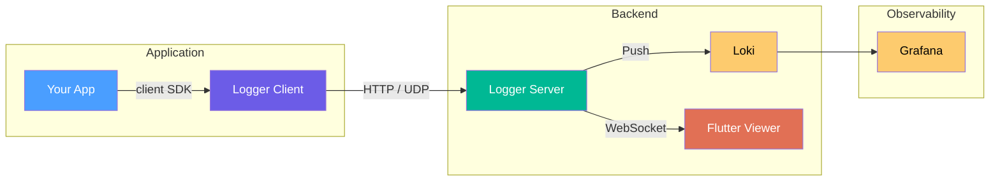

# Logger

A real-time, structured log viewer for application debugging and monitoring.

Logger captures, stores, and visualises structured log entries from any application using a lightweight client SDK. Logs are streamed over WebSocket to a Flutter desktop viewer and persisted to [Grafana Loki](https://grafana.com/oss/loki/) for long-term storage and querying.

---

## Architecture



### Components

| Component | Language | Description |
|-----------|----------|-------------|
| **Client SDK** | TypeScript | Lightweight logger that sends structured entries to the server |
| **Server** | TypeScript (Bun) | Receives logs via HTTP/UDP, stores in Loki, streams to viewers |
| **Viewer** | Dart (Flutter) | Desktop app for real-time log viewing with rich rendering |
| **Shared** | TypeScript | Common types, schemas, and constants |
| **Demo** | TypeScript | Sample application generating realistic log traffic |

---

## Quick Start

### Minimal (No Docker)

- [Bun](https://bun.sh/) 1.0+ and [Flutter](https://docs.flutter.dev/get-started/install) 3.10+

```bash
cd server && bun install && bun run src/main.ts   # Start server
cd app && flutter pub get && flutter run -d linux  # Run viewer
cd demo && bun install && bun run src/main.ts      # Send test logs
```

The viewer auto-connects to `ws://localhost:8080/api/v1/stream`. Loki warnings in the server console are expected without Docker.

### Full Stack (Docker)

- [Docker](https://docs.docker.com/get-docker/) and Docker Compose, [Flutter](https://docs.flutter.dev/get-started/install) 3.10+

```bash
docker compose up -d
cd app && flutter build linux && ./build/linux/x64/release/bundle/app
```

This launches Loki, Grafana (http://localhost:3000), Server (http://localhost:8080), and Demo.

### Integrate Your Application

```typescript
import { Logger } from "@logger/client";

const logger = new Logger({ url: "http://localhost:8080" });

logger.info("Application started", { version: "1.0.0" });
logger.error("Something went wrong", { error: err.message });
```

---

## Features

### Real-Time Log Streaming

Logs appear instantly in the viewer as they are emitted. The WebSocket connection provides sub-second latency from emission to display.

### Structured Log Entries

Every log entry carries:
- **Severity** — `trace`, `debug`, `info`, `warn`, `error`, `fatal`
- **Timestamp** — microsecond precision
- **Source** — originating module or file
- **Session** — logical grouping of related entries
- **Tags** — arbitrary key-value metadata
- **Content** — text, JSON, binary, or image data

### Custom Renderers

The viewer automatically detects and renders structured content:
- **Progress bars** — visualise task completion
- **Tables** — display tabular data inline
- **Key-Value pairs** — structured metadata display
- **Stack traces** — incrementally expandable error traces with cause-chain indicators
- **Charts** — live-updating inline visualisations from `_chart.*` state keys

### ANSI Color Support

Log text with ANSI escape codes is rendered with matching colors and styles. The client SDK provides helpers (`red`, `bold`, `rgb`, etc.) for easy colored output.

### Text Selection and Copy

Text in log rows is selectable via mouse drag. A gradient copy overlay appears on hover for quick single-row copying.

<!--
### Screenshots

> Screenshots are auto-generated. Run `bun run docs:screenshots` to update.


-->

### Session Management

Logs are grouped by session. The sidebar lists active and historical sessions, allowing quick navigation between different application runs or contexts.

### Filtering and Search

The filter bar supports:
- Severity level filtering
- Free-text search across all fields
- Source and tag-based filtering
- Time range selection

### Grafana Dashboards

Pre-configured dashboards are included:
- **Logger Overview** — aggregate log volume, severity distribution
- **Server Health** — ingestion rates, WebSocket connections, memory usage
- **Session Detail** — per-session log timeline and statistics

Access at http://localhost:3000 (default credentials: admin/admin).

---

## Configuration

### Server

| Environment Variable | Default | Description |
|---------------------|---------|-------------|
| `LOKI_URL` | `http://loki:3100` | Loki push endpoint |
| `LOGGER_BIND_ADDRESS` | `0.0.0.0` | Server bind address |
| `LOGGER_ENVIRONMENT` | `dev` | Environment label |
| `DEFAULT_SERVER_PORT` | `8080` | HTTP/API port |

### Viewer

The Flutter viewer connects to the server WebSocket endpoint. Connection settings are configured in the app UI.

---

## Project Structure

```
logger/
├── app/            Flutter desktop viewer
├── client/         TypeScript client SDK
├── server/         Bun-based log server
├── shared/         Common types and schemas
├── demo/           Demo log generator
├── grafana/        Dashboard and datasource configs
├── loki/           Loki configuration
├── mcp/            MCP tool server
├── docs/           Documentation and screenshots
│   ├── screenshots/   Auto-generated screenshots
│   └── guides/        Human-readable guides
└── scripts/        Automation scripts
```

---

## Development

### Running Tests

```bash
# Server tests
cd server && bun test

# Client tests
cd client && bun test

# Shared tests
cd shared && bun test

# Flutter widget tests
cd app && flutter test
```

### Generating Documentation Screenshots

```bash
bun run docs:screenshots
```

This launches the full stack in a headless display and captures screenshots of key features. See [scripts/capture-docs-screenshots.ts](../scripts/capture-docs-screenshots.ts).

---

## Plugin System

The Logger viewer supports a plugin architecture for extensible rendering, filtering, and transformation. Built-in plugins include chart renderer, progress bars, tables, key-value pairs, smart search, and more. See the [Plugin API Reference](reference/plugin-api.md) for details on writing custom plugins.

---

## Video Demos

> **Planned.** Screen recordings demonstrating key workflows will be added here.

---

## Documentation

| Section | Description |
|---------|-------------|
| **[Architecture](architecture/README.md)** | System architecture overview with Mermaid diagrams |
| **[Architecture Decisions](architecture/decisions/)** | ADRs for key technology and design choices |
| **[Getting Started](guides/getting-started.md)** | Step-by-step setup tutorial |
| **[Features](guides/features.md)** | Viewer feature overview |
| **[Configuration](reference/configuration.md)** | All `LOGGER_*` environment variables |
| **[Protocol](reference/protocol.md)** | LogEntry schema and transport reference |
| **[Plugin API](reference/plugin-api.md)** | How to write viewer plugins |
| **[Keybindings](reference/keybindings.md)** | Keyboard shortcuts and mouse interactions |
| **[UX Principles](design/ux-principles.md)** | Core UX design philosophy |
| **[Color System](design/color-system.md)** | Color token reference |

For AI agent navigation, see [AGENTS.md](../AGENTS.md) at the repository root.

---

## License

[Mozilla Public License 2.0](../LICENSE) — see [LICENSE](../LICENSE) for full text.
