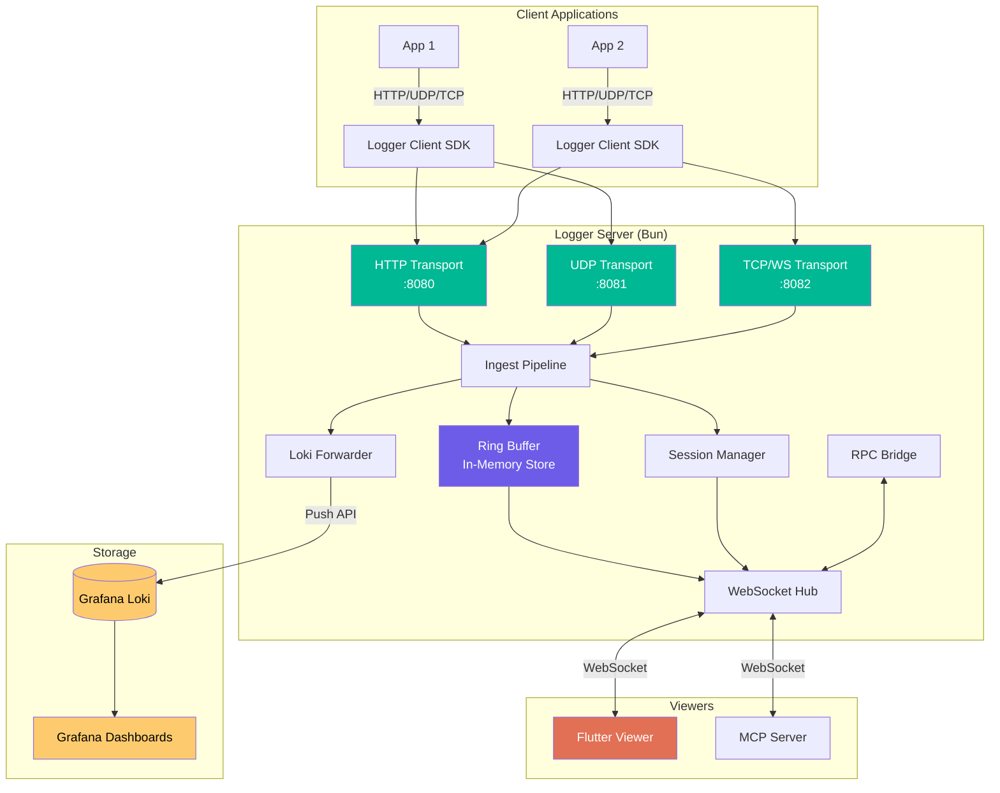
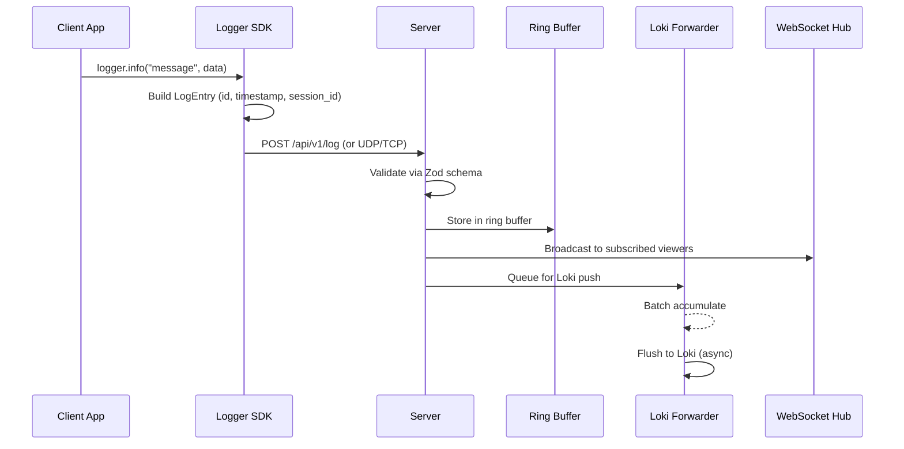
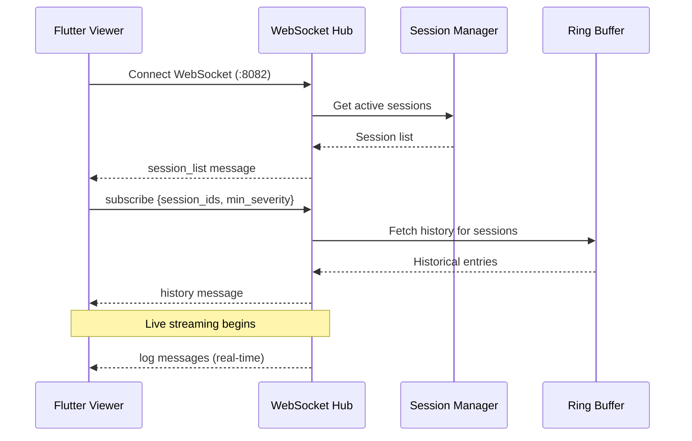

# Architecture Overview

Logger's architecture follows a **hub-and-spoke** pattern: a central server receives logs from multiple client applications and fans them out to viewers and storage backends.

## System Diagram



## Component Overview

### Server (`packages/server/src/`)

The server is a Bun-based TypeScript application with modular architecture:

| Module | File | Responsibility |
|--------|------|----------------|
| **HTTP Transport** | `transport/http.ts` | REST API for log ingestion, health checks, image upload |
| **UDP Transport** | `transport/udp.ts` | High-throughput UDP log ingestion |
| **TCP Transport** | `transport/tcp.ts` | TCP + WebSocket for viewer connections |
| **Ingest Pipeline** | `transport/ingest.ts` | Validates, timestamps, routes incoming logs |
| **Ring Buffer** | `modules/ring-buffer.ts` | In-memory log storage with size-based eviction |
| **Session Manager** | `modules/session-manager.ts` | Tracks active sessions, heartbeats, lifecycle |
| **Loki Forwarder** | `modules/loki-forwarder.ts` | Async batch push to Grafana Loki |
| **WebSocket Hub** | `modules/ws-hub.ts` | Manages viewer connections, subscriptions, broadcasting |
| **RPC Bridge** | `modules/rpc-bridge.ts` | Bidirectional RPC between viewers and client apps |
| **File Store** | `modules/file-store.ts` | Disk-based storage for uploaded images |

### Client SDK (`packages/client/src/`)

Lightweight TypeScript library for sending structured logs:

| File | Responsibility |
|------|----------------|
| `logger.ts` | Main `Logger` class — configuration, transport selection |
| `logger-session.ts` | Session lifecycle (start, heartbeat, end) |
| `logger-builders.ts` | Fluent API for building log entries |
| `queue.ts` | Batching queue with configurable flush interval |
| `stack-parser.ts` | Cross-runtime stack trace parsing |

### Viewer (`app/lib/`)

Flutter desktop application (Linux-first):

| Directory | Responsibility |
|-----------|----------------|
| `models/` | Dart data models mirroring shared schemas |
| `plugins/` | Plugin system — registry, types, built-in plugins |
| `screens/` | Top-level screen widgets |
| `services/` | WebSocket client, state management services |
| `theme/` | Custom dark theme, color tokens, typography |
| `widgets/` | Reusable UI components (log list, renderers, filters) |

### Shared (`packages/shared/src/`)

Zod schemas that serve as the **single source of truth** for the protocol:

- `log-entry.ts` — `LogEntry` schema with all fields and types
- `server-message.ts` — Messages from server to viewer
- `viewer-message.ts` — Messages from viewer to server
- `custom-renderers.ts` — Custom renderer type definitions

## Data Flow

### Log Ingestion



### Viewer Connection



## Key Design Decisions

See [Architecture Decision Records](decisions/) for detailed rationale:

- [ADR-001: Bun Runtime](decisions/001-bun-runtime.md) — Why Bun over Node.js
- [ADR-002: Flutter Desktop](decisions/002-flutter-desktop.md) — Why Flutter for the viewer
- [ADR-003: Loki Persistence](decisions/003-loki-persistence.md) — Why Grafana Loki
- [ADR-004: WebSocket Primary](decisions/004-websocket-primary.md) — Why WebSocket for viewer comms
- [ADR-005: Plugin Architecture](decisions/005-plugin-architecture.md) — Plugin extensibility approach

## Deployment

Logger runs entirely via Docker Compose for local development:

```
docker compose up -d
```

Services: Loki (log storage), Grafana (dashboards), Server (log ingestion), Demo (sample traffic). The Flutter viewer runs natively on the host machine.

See [Configuration Reference](../reference/configuration.md) for all environment variables.
